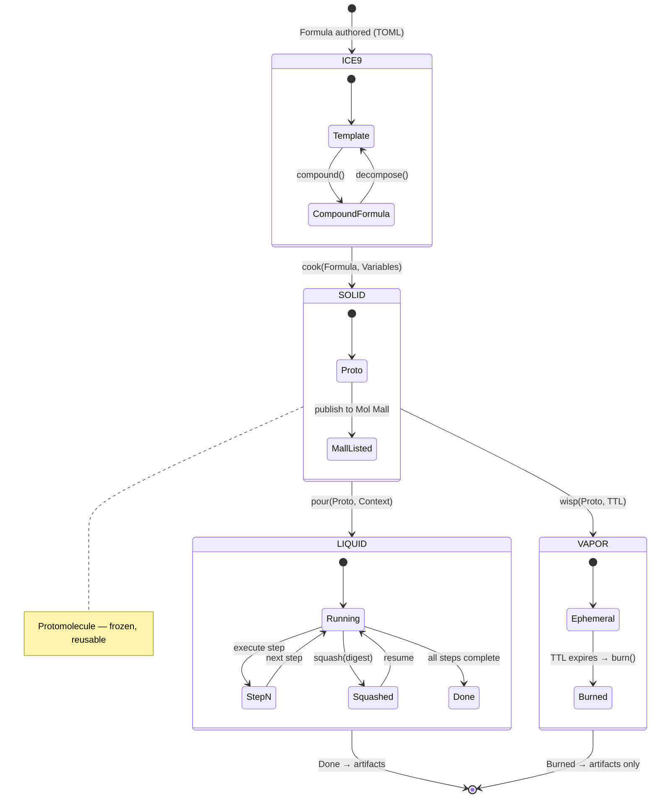
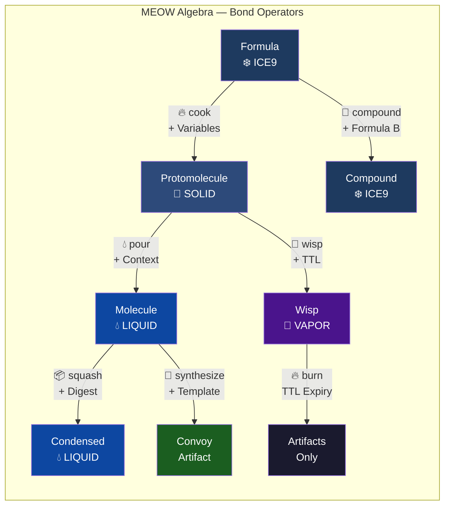
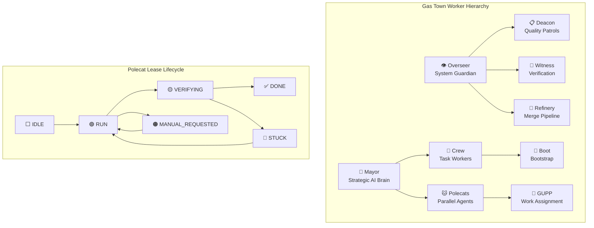
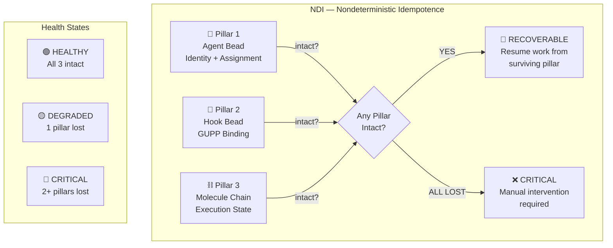
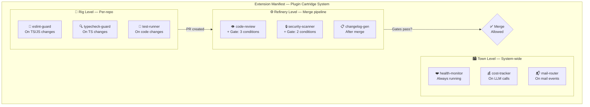

# Gas Town — AI Agent Orchestration Engine

> **White-label, production-grade AI agent orchestration inspired by Steve Yegge's "Gas Town" architecture.**
>
> *"Generators fill the reservoir, Convoys consume it."*

Gas Town is a complete system for orchestrating autonomous AI agents at scale. It implements a molecular work execution model (MEOW), hierarchical agent governance, capability-based security, and a full lifecycle for tasks from creation to deployment.

---

## Architecture Overview

```mermaid
graph TB
  subgraph "🏛️ GAS TOWN — AI Agent Orchestration Engine"
    direction TB

    %% ═══════════════════════════════════════════════════
    %% TOP LAYER: GOVERNANCE & COMMAND
    %% ═══════════════════════════════════════════════════
    subgraph GOV["⚖️ GOVERNANCE LAYER"]
      direction LR
      MAYOR["🎩 Mayor<br/>Strategic AI Brain<br/>Priority Scoring<br/>Resource Allocation<br/>Conflict Resolution"]
      OVERSEER["👁️ Overseer<br/>System Guardian<br/>Health Monitor<br/>Zombie Detection<br/>Circuit Breaker"]
      COUNCIL["🏛️ Entity Council<br/>Multi-Entity Consensus<br/>Quorum Voting<br/>Cross-Domain Arbitration"]
    end

    %% ═══════════════════════════════════════════════════
    %% COMMAND LAYER: GT CLI + GUPP
    %% ═══════════════════════════════════════════════════
    subgraph CMD["⌨️ COMMAND & PROPULSION"]
      direction LR
      CLI["🖥️ GT CLI<br/>15 Commands:<br/>sling · nudge · seance<br/>handoff · convoy · mall<br/>guzzoline · plugins · ndi<br/>bonds · compound · stats<br/>lease · beads · help"]
      GUPP["🔗 GUPP Engine<br/>Hook-Based Assignment<br/>Work → Agent Binding<br/>Priority Resolution"]
      GUZZ["⛽ Guzzoline Reservoir<br/>Capacity Tracking<br/>Generators vs Consumers<br/>Low-Fuel Alerts"]
    end

    %% ═══════════════════════════════════════════════════
    %% MEOW STATE MACHINE
    %% ═══════════════════════════════════════════════════
    subgraph MEOW["🧬 MEOW — Molecular Expression of Work"]
      direction LR

      subgraph ICE9["❄️ ICE9<br/>Frozen Templates"]
        TOML["📄 TOML Formulas<br/>10 Built-in Templates"]
        COMPOUND["🔗 Compound Formulas<br/>Sequential · Parallel<br/>Conditional · Fan-Out"]
      end

      subgraph SOLID["🧊 SOLID<br/>Protomolecules"]
        PROTO["🧪 Protomolecule<br/>cook(Formula, Vars)"]
        MALL["🏪 Mol Mall<br/>Formula Marketplace<br/>Browse · Install · Rate"]
      end

      subgraph LIQUID["💧 LIQUID<br/>Active Molecules"]
        MOL["⚗️ Molecule<br/>pour(Proto, Context)<br/>Step-by-Step Execution"]
        SQUASH["📦 Squash<br/>Digest Compression"]
      end

      subgraph VAPOR["💨 VAPOR<br/>Ephemeral Wisps"]
        WISP["👻 Wisp<br/>wisp(Proto, TTL)<br/>In-Memory Only<br/>Auto-Destruct"]
      end
    end

    %% ═══════════════════════════════════════════════════
    %% WORKER HIERARCHY
    %% ═══════════════════════════════════════════════════
    subgraph WORKERS["🐝 WORKER HIERARCHY"]
      direction LR

      subgraph CREW_LAYER["👥 Crew"]
        CREW["👷 Crew Workers<br/>Task Execution<br/>Skill-Based Routing"]
        POLECAT["🐱 Polecats<br/>Parallel Spawning<br/>Lease Lifecycle<br/>RUN → VERIFYING →<br/>MANUAL → STUCK"]
      end

      subgraph PATROL_LAYER["🛡️ Patrols"]
        DEACON["📋 Deacon<br/>Real Patrols<br/>Quality Checks"]
        WITNESS["👀 Witness<br/>Output Verification<br/>Approval Gates"]
        REFINERY["🔧 Refinery<br/>Merge Pipeline<br/>Code Review"]
      end

      subgraph SUPPORT["🔧 Support"]
        BOOT["🥾 Boot<br/>System Bootstrap<br/>Initialization"]
        DOGS["🐕 Dogs<br/>Background Tasks<br/>Cleanup · Monitoring"]
      end
    end

    %% ═══════════════════════════════════════════════════
    %% COGNITIVE LAYER (32 MODULES)
    %% ═══════════════════════════════════════════════════
    subgraph COGNITIVE["🧠 COGNITIVE LAYER — 32 AI Modules"]
      direction LR

      subgraph COG_MAYOR["Mayor Intelligence"]
        PRI["Priority Scoring"]
        RES["Resource Allocation"]
        CONF["Conflict Resolution"]
        CONV["Convoy Composition"]
      end

      subgraph COG_OPS["Operational Intelligence"]
        RETRY["Auto-Retry"]
        ESCL["Escalation"]
        FAIL["Failure Prediction"]
        ZOMBIE["Zombie Detection"]
        DRIFT["Drift Detection"]
      end

      subgraph COG_FORMULA["Formula Intelligence"]
        FEVO["Formula Evolution"]
        CROSS["Cross-Formula Optimization"]
        ABTST["A/B Testing"]
        SCHED["Formula Scheduling"]
      end

      subgraph COG_LEARN["Learning & Knowledge"]
        XMOL["Cross-Molecule Knowledge"]
        PLIB["Pattern Library"]
        RETRO["Retrospective Engine"]
        CONTIMPR["Continuous Improvement"]
      end

      subgraph COG_SPECIAL["Specialized"]
        BUDGET["Budget AI"]
        COSTF["Cost Forecasting"]
        DEMAND["Demand Forecasting"]
        OUTCOME["Outcome Prediction"]
        QUALITY["Output Quality"]
        AUTOAP["Auto-Approve"]
        TIER["Dynamic Tier Adjust"]
        ATLAS["Atlas Country Inject"]
        NOUS["Nous Epistemic Inject"]
        MEGA["MegaBrain Context"]
        QUEUE["Queue Rebalancing"]
        WPERF["Worker Performance"]
        SKILL_AI["Skill Auto-Selection"]
        SKILL_RANK["Skill Perf Ranking"]
        MAIL_AI["Intelligent Mail Route"]
      end
    end

    %% ═══════════════════════════════════════════════════
    %% SKILLS SYSTEM
    %% ═══════════════════════════════════════════════════
    subgraph SKILLS["🛠️ SKILL REGISTRY — 10 Built-in Skills"]
      direction LR
      SK_CONTENT["✍️ Content<br/>Generate"]
      SK_DATA["📊 Data<br/>Analyze"]
      SK_DEPLOY["🚀 Deploy<br/>LP"]
      SK_GIT["🔀 Git<br/>Ops"]
      SK_META["📱 Meta<br/>Ads"]
      SK_SHOPIFY["🛒 Shopify"]
      SK_SCRAPE["🕸️ Web<br/>Scrape"]
      SK_WA["💬 WhatsApp"]
      SK_BUILTIN["📦 Built-in<br/>Skills"]
    end

    %% ═══════════════════════════════════════════════════
    %% EXTENSION SYSTEM
    %% ═══════════════════════════════════════════════════
    subgraph EXTENSIONS["🔌 EXTENSION MANIFEST — Plugin System"]
      direction LR

      subgraph EXT_TOWN["🏙️ Town Level"]
        HEALTH_MON["❤️ Health Monitor"]
        COST_TRACK["💰 Cost Tracker"]
        MAIL_ROUTE["📬 Mail Router"]
      end

      subgraph EXT_RIG["🔧 Rig Level"]
        ESLINT["📝 ESLint Guard"]
        TYPECHECK["🔍 TypeCheck Guard"]
        TEST_RUN["🧪 Test Runner"]
      end

      subgraph EXT_REFINERY["⚙️ Refinery Level"]
        CODE_REV["👁️ Code Review + Gate"]
        SEC_SCAN["🔒 Security Scanner + Gate"]
        CHANGELOG["📋 Changelog Generator"]
      end
    end

    %% ═══════════════════════════════════════════════════
    %% NDI & PERSISTENCE
    %% ═══════════════════════════════════════════════════
    subgraph NDI["🔒 NDI — Nondeterministic Idempotence"]
      direction LR
      PILLAR1["🪪 Agent Bead<br/>Identity + Assignment"]
      PILLAR2["🔗 Hook Bead<br/>GUPP Binding"]
      PILLAR3["⛓️ Molecule Chain<br/>Execution State"]
      RECOVERY["🔄 Recovery<br/>If ANY pillar intact<br/>→ Work survives"]
    end

    %% ═══════════════════════════════════════════════════
    %% OBSERVABILITY
    %% ═══════════════════════════════════════════════════
    subgraph OBS["📡 OBSERVABILITY"]
      direction LR
      AUDIT["📜 Audit Log"]
      COST_OBS["💲 Cost Tracking"]
      ERR_CLASS["🚨 Error Classification"]
      OUTCOME_OBS["📈 Outcome Tracking"]
      PERF_BASE["📊 Performance Baselines"]
    end

    %% ═══════════════════════════════════════════════════
    %% BRIDGES & SYNC
    %% ═══════════════════════════════════════════════════
    subgraph BRIDGES["🌉 BRIDGES & SYNC"]
      direction LR

      subgraph MAIL_BRIDGES["📨 Mail Bridges"]
        BR_EMAIL["📧 Email"]
        BR_SLACK["💬 Slack"]
        BR_SSE["📡 SSE"]
        BR_WA["📱 WhatsApp"]
      end

      subgraph SYNC_LAYER["🔄 Sync Layer"]
        SY_GH["🔀 GitHub Sync"]
        SY_MB["🧠 MegaBrain Sync"]
        SY_PQ["📋 Project Queue"]
        SY_SB["🗄️ Supabase Persist"]
      end

      subgraph TRIGGERS["⚡ Triggers"]
        TR_CRON["⏰ Cron"]
        TR_EVENT["🎯 Event Chain"]
        TR_THRESH["📏 Threshold"]
        TR_WEBHOOK["🔗 Webhook"]
      end
    end

    %% ═══════════════════════════════════════════════════
    %% SOVEREIGN MODULES
    %% ═══════════════════════════════════════════════════
    subgraph SOVEREIGN["👑 SOVEREIGN — 32 Advanced Modules"]
      direction LR

      subgraph SOV_CORE["Core"]
        CLI2["GT CLI"]
        GUZZ2["Guzzoline + NDI"]
        GT_CMD["GT Commands"]
        MALL2["Mol Mall"]
        EXT2["Extensions"]
      end

      subgraph SOV_OPS["Operations"]
        CHAOS["🎲 Chaos Engineering"]
        CRISIS["🚨 Crisis Mode"]
        CIRC["🕐 Circadian Rhythm"]
        GRACE["🪶 Graceful Degradation"]
        MAINT["🔧 Maintenance Mode"]
        SNAP["📸 State Snapshot"]
        SELF_SCHED["📅 Self-Scheduling"]
      end

      subgraph SOV_ADV["Advanced"]
        API_GW["🌐 API Gateway"]
        ATLAS_ADV["🗺️ Atlas World"]
        REPORTS["📊 Auto Reports"]
        CHRONICLE["📜 Chronicle"]
        CONTENT_FAC["🏭 Content Factory"]
        JOURNAL["📖 Decision Journal"]
        FEDERATION["🌍 Federation"]
        FAILOVER["🔄 Cross-Region Failover"]
        GENESIS["🧬 Formula Genesis"]
        FMKT["🏪 Formula Marketplace"]
        MOROS["🎩 Moros Supreme Mayor"]
        NOUS_ORC["🔮 Nous Oracle"]
        REP_SYS["⭐ Reputation System"]
        SKILL_EVO["🧪 Skill Evolution"]
        WEBHOOKS["🔔 Webhooks Outbound"]
        W_MEM["💾 Worker Memory"]
        W_SPEC["🎯 Worker Specialization"]
      end

      subgraph SOV_DOMAIN["Domain Adapters"]
        DG_ADAPT["🌎 Ecommerce"]
        DL_ADAPT["🌎 Market"]
      end
    end

    %% ═══════════════════════════════════════════════════
    %% INFRASTRUCTURE
    %% ═══════════════════════════════════════════════════
    subgraph INFRA["🏗️ INFRASTRUCTURE"]
      direction LR
      DB["🗄️ PostgreSQL<br/>pg Pool"]
      SSE["📡 SSE Broadcast<br/>Real-time Events"]
      LOG["📝 Pino Logger"]
      GEMINI["🤖 Gemini LLM<br/>OpenAI-compat"]
    end
  end

  %% ═══════════════════════════════════════════════════
  %% CONNECTIONS — GOVERNANCE
  %% ═══════════════════════════════════════════════════
  MAYOR -->|"prioritize<br/>allocate"| WORKERS
  MAYOR -->|"compose"| CONV
  OVERSEER -->|"monitor<br/>circuit-break"| WORKERS
  OVERSEER -->|"detect"| ZOMBIE
  COUNCIL -->|"arbitrate"| MAYOR

  %% CONNECTIONS — COMMAND
  CLI -->|"dispatch"| GUPP
  CLI -->|"query"| GUZZ
  CLI -->|"manage"| MALL
  GUPP -->|"assign work"| CREW
  GUPP -->|"spawn"| POLECAT
  GUZZ -->|"capacity check"| MAYOR

  %% CONNECTIONS — MEOW FLOW
  TOML -->|"cook(vars)"| PROTO
  COMPOUND -->|"compose"| TOML
  PROTO -->|"pour(ctx)"| MOL
  PROTO -->|"wisp(ttl)"| WISP
  MOL -->|"squash"| SQUASH
  MALL -->|"distribute"| TOML

  %% CONNECTIONS — WORKERS
  CREW -->|"use"| SKILLS
  POLECAT -->|"execute"| MOL
  DEACON -->|"patrol"| MOL
  WITNESS -->|"verify"| POLECAT
  REFINERY -->|"gate"| CODE_REV

  %% CONNECTIONS — COGNITIVE
  COGNITIVE -->|"inform"| MAYOR
  COGNITIVE -->|"optimize"| WORKERS
  COGNITIVE -->|"evolve"| TOML

  %% CONNECTIONS — NDI
  PILLAR1 --> RECOVERY
  PILLAR2 --> RECOVERY
  PILLAR3 --> RECOVERY
  RECOVERY -->|"resume"| MOL

  %% CONNECTIONS — OBSERVABILITY
  WORKERS -->|"emit"| OBS
  MOL -->|"emit"| OBS
  OBS -->|"store"| DB

  %% CONNECTIONS — BRIDGES
  WORKERS -->|"notify"| BRIDGES
  TRIGGERS -->|"activate"| GUPP
  SYNC_LAYER -->|"persist"| DB

  %% CONNECTIONS — INFRA
  WORKERS -->|"query"| DB
  WORKERS -->|"call"| GEMINI
  MOL -->|"broadcast"| SSE

  %% ═══════════════════════════════════════════════════
  %% STYLING
  %% ═══════════════════════════════════════════════════
  classDef gov fill:#1a1a2e,stroke:#e94560,stroke-width:2px,color:#fff
  classDef cmd fill:#16213e,stroke:#0f3460,stroke-width:2px,color:#fff
  classDef meow fill:#0f3460,stroke:#533483,stroke-width:2px,color:#fff
  classDef workers fill:#1a1a2e,stroke:#e94560,stroke-width:1px,color:#fff
  classDef cognitive fill:#533483,stroke:#e94560,stroke-width:1px,color:#fff
  classDef infra fill:#16213e,stroke:#0f3460,stroke-width:1px,color:#fff

  class MAYOR,OVERSEER,COUNCIL gov
  class CLI,GUPP,GUZZ cmd
  class TOML,PROTO,MOL,WISP,COMPOUND,SQUASH,MALL meow
  class CREW,POLECAT,DEACON,WITNESS,REFINERY,BOOT,DOGS workers
  class PRI,RES,CONF,CONV,RETRY,ESCL,FAIL,ZOMBIE,DRIFT cognitive
  class DB,SSE,LOG,GEMINI infra
```



## MEOW State Machine — Detailed Flow



## Bond Operator Table



## Worker Hierarchy



## NDI — Three Pillars of Persistence



## Extension System — Three Levels



---

## Directory Structure

```
gastown/
├── README.md                          # This file
├── package.json                       # Standalone package
├── tsconfig.json                      # TypeScript config
├── gastown.config.ts                  # White-label configuration
│
├── src/
│   ├── meow/
│   │   ├── types.ts                   # Core type system (MEOWPhase, Capability, Beads)
│   │   ├── engine.ts                  # MEOW engine core
│   │   ├── formula-parser.ts          # TOML formula parser
│   │   ├── molecule-runner.ts         # Molecule execution engine
│   │   ├── wisp-system.ts            # Ephemeral wisp system
│   │   ├── hooks-engine.ts           # GUPP hook engine
│   │   ├── convoy-manager.ts         # Convoy orchestration
│   │   ├── worker-pool.ts            # Worker pool management
│   │   ├── patrols-engine.ts         # Patrol coordination
│   │   ├── refinery.ts              # Merge pipeline
│   │   ├── skill-registry.ts        # Skill registry
│   │   ├── skill-runtime.ts         # Skill execution runtime
│   │   ├── state-guards.ts          # State transition guards
│   │   ├── workspace-gov.ts         # Workspace governance
│   │   ├── mail.ts                  # Inter-agent mail
│   │   ├── mail-advanced.ts         # Advanced mail features
│   │   │
│   │   ├── workers/                 # 9 Worker role implementations
│   │   │   ├── mayor.ts            # Strategic AI brain
│   │   │   ├── overseer.ts         # System guardian
│   │   │   ├── crew.ts             # Task workers
│   │   │   ├── polecat.ts          # Parallel agents
│   │   │   ├── witness.ts          # Verification
│   │   │   ├── deacon.ts           # Quality patrols
│   │   │   ├── gupp.ts             # Work assignment
│   │   │   ├── boot.ts             # System bootstrap
│   │   │   └── index.ts
│   │   │
│   │   ├── execution/               # 6 Execution modules
│   │   │   ├── gemini-executor.ts   # LLM execution (Gemini)
│   │   │   ├── mayor-ai.ts         # Mayor AI decisions
│   │   │   ├── polecat-spawner.ts   # Polecat lifecycle
│   │   │   ├── crew-agent-bridge.ts # Crew-Agent bridge
│   │   │   ├── deacon-real-patrols.ts
│   │   │   └── witness-supervisor.ts
│   │   │
│   │   ├── cognitive/               # 32 AI intelligence modules
│   │   │   ├── mayor-priority-scoring.ts
│   │   │   ├── mayor-resource-allocation.ts
│   │   │   ├── mayor-conflict-resolution.ts
│   │   │   ├── mayor-convoy-composition.ts
│   │   │   ├── auto-retry-intelligence.ts
│   │   │   ├── escalation-intelligence.ts
│   │   │   ├── failure-prediction.ts
│   │   │   ├── zombie-detection-advanced.ts
│   │   │   ├── drift-detection.ts
│   │   │   ├── formula-evolution.ts
│   │   │   ├── cross-formula-optimization.ts
│   │   │   ├── ab-formula-testing.ts
│   │   │   ├── formula-scheduling-ai.ts
│   │   │   ├── cross-molecule-knowledge.ts
│   │   │   ├── pattern-library.ts
│   │   │   ├── retrospective-engine.ts
│   │   │   ├── continuous-improvement.ts
│   │   │   ├── budget-management-ai.ts
│   │   │   ├── cost-forecasting.ts
│   │   │   ├── demand-forecasting.ts
│   │   │   ├── outcome-prediction.ts
│   │   │   ├── output-quality-scorer.ts
│   │   │   ├── auto-approve-engine.ts
│   │   │   ├── dynamic-tier-adjustment.ts
│   │   │   ├── atlas-country-injection.ts
│   │   │   ├── nous-epistemic-injection.ts
│   │   │   ├── megabrain-worker-context.ts
│   │   │   ├── queue-rebalancing.ts
│   │   │   ├── worker-performance-learning.ts
│   │   │   ├── skill-auto-selection.ts
│   │   │   ├── skill-performance-ranking.ts
│   │   │   └── intelligent-mail-routing.ts
│   │   │
│   │   ├── sovereign/               # 32 Advanced sovereign modules
│   │   │   ├── gastown-cli.ts       # GT CLI (15 commands)
│   │   │   ├── gt-commands.ts       # GT core commands
│   │   │   ├── guzzoline-ndi.ts     # Guzzoline + NDI + Bond Ops
│   │   │   ├── mol-mall.ts          # Formula marketplace
│   │   │   ├── extension-manifest.ts # Plugin system
│   │   │   ├── api-gateway.ts
│   │   │   ├── atlas-world-advisor.ts
│   │   │   ├── auto-reports.ts
│   │   │   ├── chaos-engineering.ts
│   │   │   ├── circadian-rhythm.ts
│   │   │   ├── crisis-mode.ts
│   │   │   ├── cross-region-failover.ts
│   │   │   ├── decision-journal.ts
│   │   │   ├── entity-council.ts
│   │   │   ├── formula-genesis.ts
│   │   │   ├── formula-marketplace.ts
│   │   │   ├── gastown-chronicle.ts
│   │   │   ├── gastown-content-factory.ts
│   │   │   ├── gastown-federation.ts
│   │   │   ├── graceful-degradation.ts
│   │   │   ├── maintenance-mode.ts
│   │   │   ├── moros-supreme-mayor.ts
│   │   │   ├── nous-epistemic-oracle.ts
│   │   │   ├── reputation-system.ts
│   │   │   ├── self-scheduling.ts
│   │   │   ├── skill-evolution.ts
│   │   │   ├── state-snapshot.ts
│   │   │   ├── webhooks-outbound.ts
│   │   │   ├── worker-persistent-memory.ts
│   │   │   └── worker-specialization.ts
│   │   │
│   │   ├── skills/                  # 10 Built-in skills
│   │   ├── observability/           # 6 Observability modules
│   │   ├── bridges/                 # 5 Mail bridges
│   │   ├── sync/                    # 5 Sync modules
│   │   └── triggers/                # 5 Trigger types
│   │
│   ├── lib/
│   │   └── logger.ts               # Pino logger
│   └── db/
│       └── client.ts               # PostgreSQL pool
│
├── formulas/                        # 10 TOML formula templates
│   ├── campaign-launch.formula.toml
│   ├── content-pipeline.formula.toml
│   ├── product-discovery.formula.toml
│   └── ...
│
├── frontend/
│   └── components/
│       ├── GasTownHQView.tsx        # Main dashboard (21 panels)
│       ├── GasTownTimelineView.tsx   # Timeline visualization
│       └── GasTownIntegrationPanel.tsx # Integration panel
│
├── migrations/
│   └── 051_meow_engine.sql          # Database schema
│
└── docs/
    └── gas-town-concepts.md         # Yegge's original concepts
```

---

## Core Concepts

### 1. MEOW — Molecular Expression of Work

Work flows through four phases like matter:

| Phase | Name | Description | Persistence |
|-------|------|-------------|-------------|
| `ICE9` | Frozen Template | TOML formula source code | Git (immutable) |
| `SOLID` | Protomolecule | Variables substituted, reusable | Database |
| `LIQUID` | Molecule | Active execution, step-by-step | Database + Memory |
| `VAPOR` | Wisp | Ephemeral, TTL-bound, in-memory | Memory only |

### 2. Gas Town Worker Roles

| Role | Responsibility |
|------|---------------|
| **Mayor** | Strategic AI brain — prioritization, resource allocation, conflict resolution |
| **Overseer** | System guardian — health monitoring, zombie detection, circuit breaking |
| **Crew** | Task workers — execute assigned work using skills |
| **Polecats** | Parallel agents — spawn for concurrent execution |
| **Witness** | Verification — output quality and approval gates |
| **Deacon** | Quality patrols — continuous quality monitoring |
| **Refinery** | Merge pipeline — code review, security scanning, changelog |
| **Boot** | System bootstrap — initialization and configuration |
| **GUPP** | Work assignment — hook-based propulsion (Gastown Universal Propulsion Principle) |

### 3. GT CLI Commands

| Command | Description |
|---------|-------------|
| `gt sling <bead-id>` | Assign bead to best available polecat |
| `gt nudge <polecat-id>` | Prompt stuck polecat to continue |
| `gt seance <polecat-id>` | Reconnect to running polecat session |
| `gt handoff <from> <to>` | Transfer work between polecats |
| `gt convoy [beads...]` | Launch parallel multi-bead execution |
| `gt mall [browse\|install\|search\|stats]` | Mol Mall formula marketplace |
| `gt guzzoline` | Show fuel reservoir status |
| `gt plugins` | List extension manifest plugins |
| `gt ndi <agent-id> <bead-id>` | Check NDI persistence pillars |
| `gt bonds` | Display bond operator table |
| `gt compound` | List compound formula definitions |
| `gt stats` | Show system-wide statistics |
| `gt lease` | Show polecat lease statuses |
| `gt beads [release\|pipeline]` | Beads release pipeline (20 steps) |
| `gt help` | Show all commands |

### 4. Guzzoline Reservoir

The fuel metaphor for system capacity:
- **Generators** fill the reservoir: issue backlog, budget top-up, slot release, quota reset
- **Consumers** drain it: polecat work, API calls, merge ops, patrol runs
- **Low fuel alert** at < 20% triggers SSE broadcast

### 5. NDI — Nondeterministic Idempotence

Three Pillars of Persistence ensure work survives failures:
1. **Agent Bead** — who is doing the work
2. **Hook Bead** — what work is bound to whom
3. **Molecule Chain** — where in the workflow

If ANY pillar is intact, work can be recovered. Sessions are cattle; agents are persistent identities.

---

## White-Label Configuration

```typescript
// gastown.config.ts
export const config = {
  // Branding
  name: 'Gas Town',
  logo: '/logo.svg',
  theme: {
    primary: '#e94560',
    background: '#0d1117',
    surface: '#161b22',
    text: '#c9d1d9',
  },

  // LLM Provider
  llm: {
    provider: 'gemini',
    model: 'gemini-2.0-flash',
    endpoint: 'https://generativelanguage.googleapis.com/v1beta/openai/chat/completions',
  },

  // Database
  database: {
    provider: 'postgresql',
    url: process.env.DATABASE_URL,
  },

  // Capabilities
  capabilities: {
    maxPolecats: 10,
    maxConcurrentMolecules: 50,
    wispTTLSeconds: 3600,
    budgetDailyUSD: 50,
  },

  // Extensions
  extensions: {
    enableBuiltinPlugins: true,
    customPluginDirs: [],
  },
};
```

---

## Quick Start

```bash
# Clone
git clone https://github.com/kiaquo981/gastown.git
cd gastown

# Install
npm install

# Configure
cp .env.example .env
# Edit .env with your DATABASE_URL, GEMINI_API_KEY, etc.

# Run migrations
psql $DATABASE_URL < migrations/051_meow_engine.sql

# Start
npm run dev
```

---

## Stats

| Metric | Count |
|--------|-------|
| Total TypeScript files | 149+ |
| Total lines of code | ~96,500 |
| Worker roles | 9 |
| Cognitive AI modules | 32 |
| Sovereign modules | 32 |
| Built-in skills | 10 |
| TOML formulas | 10 |
| GT CLI commands | 15 |
| Extension plugins | 9 |
| Mail bridges | 4 |
| Sync modules | 4 |
| Trigger types | 4 |
| Frontend panels | 21 |

---

## Credits

Architecture inspired by [Steve Yegge's "Gas Town"](https://steve-yegge.medium.com/) article on AI agent orchestration.

Built with Gas Town.

## License

MIT
