# Gas Town — Complete System Architecture

## 1. High-Level System Overview

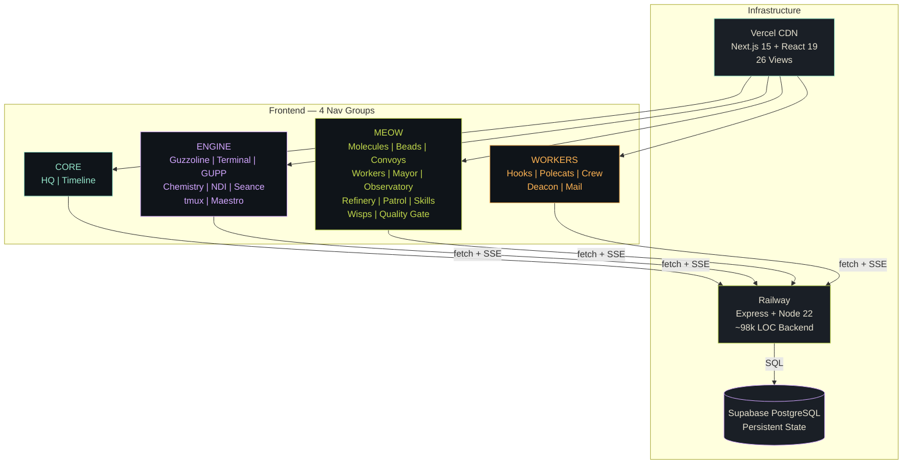

## 2. Backend Architecture — Module Map

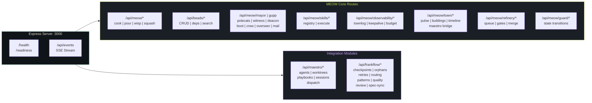

## 3. MEOW Engine — Molecular State Machine

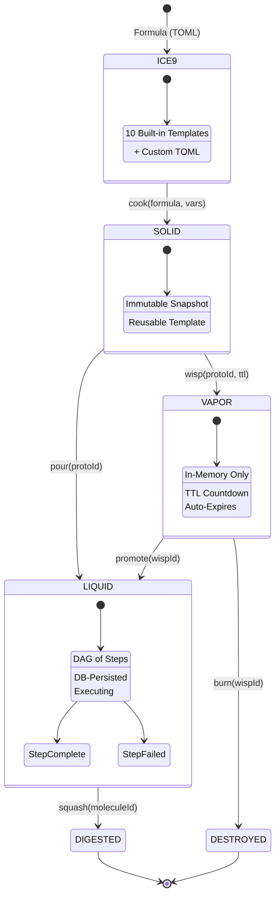

## 4. Complete Bead Lifecycle — From Creation to Done

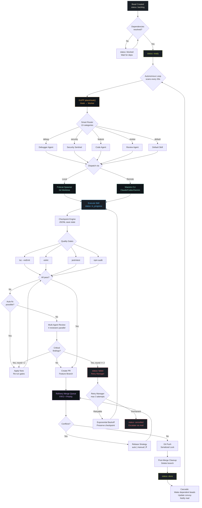

## 5. Worker Ecosystem — 9 Roles

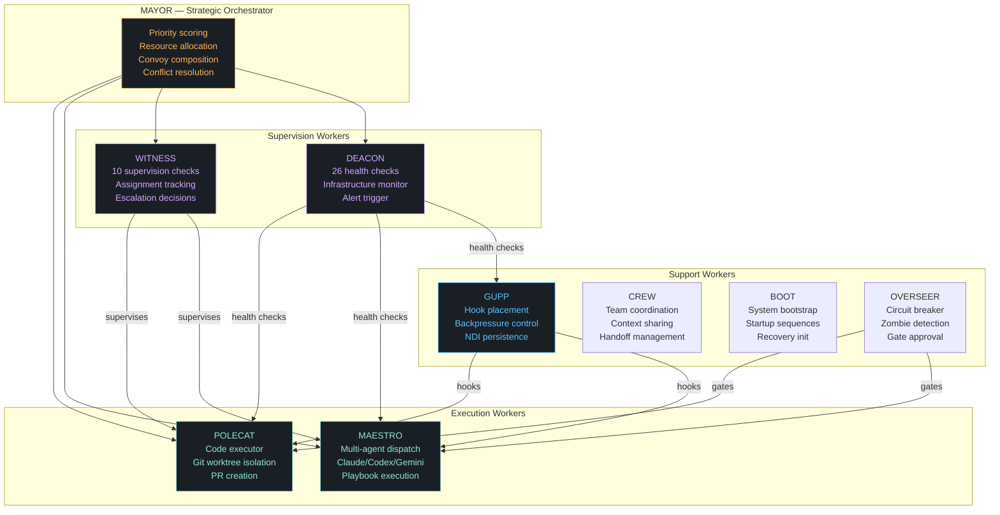

## 6. Maestro Integration — Multi-Agent Dispatch

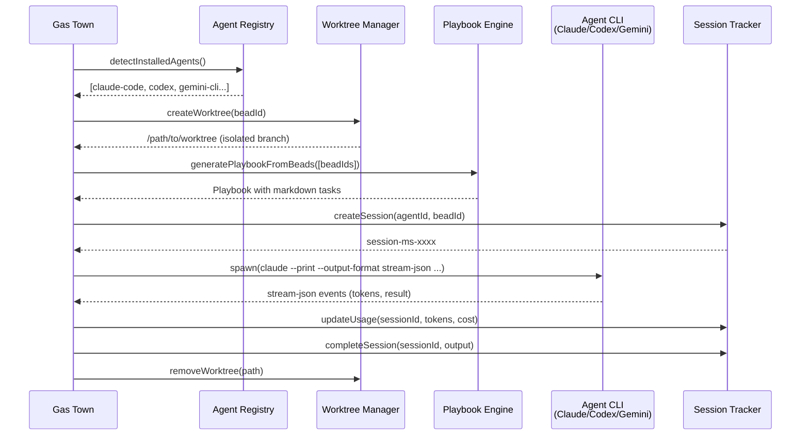

## 7. FrankFlow Execution Logic — Crash-Safe Pipeline

```mermaid
flowchart LR
    subgraph CHECKPOINT["Checkpoint Engine"]
        CE_START["Start execution"] --> CE_SAVE["saveCheckpoint(key, value)<br/>Append JSONL"]
        CE_SAVE --> CE_EXEC["Execute step"]
        CE_EXEC --> CE_CRASH{"Crash?"}
        CE_CRASH -->|Yes| CE_RESTORE["Restore from JSONL<br/>Skip completed steps"]
        CE_RESTORE --> CE_EXEC
        CE_CRASH -->|No| CE_NEXT["Next step"]
        CE_NEXT --> CE_SAVE
    end

    subgraph ORPHAN["Orphan Detector"]
        OD_SCAN["Scan workers"] --> OD_PID{"PID alive?<br/>kill(pid, 0)"}
        OD_PID -->|Dead| OD_RECOVER["Recover: reset to pending"]
        OD_PID -->|Alive| OD_HB{"Heartbeat<br/>< 5min?"}
        OD_HB -->|Stale| OD_RECOVER
        OD_HB -->|Fresh| OD_OK["Worker OK"]
    end

    subgraph RETRY["Retry Manager"]
        RM_ERR["Error occurred"] --> RM_CLASS{"Classify error"}
        RM_CLASS -->|Transient| RM_SCHED["Schedule retry<br/>Exponential backoff"]
        RM_CLASS -->|Permanent| RM_FAIL["Mark failed"]
        RM_SCHED --> RM_WAIT["Wait delay"] --> RM_EXEC["Re-execute<br/>From checkpoint"]
    end

    subgraph ROUTER["Smart Router"]
        SR_IN["Task text"] --> SR_MATCH["Pattern match<br/>13 categories"]
        SR_MATCH --> SR_OUT["Route to specialist<br/>+ inject context"]
    end

    subgraph LEARNER["Pattern Learner"]
        PL_ERR["Error"] --> PL_HASH["MD5 normalize<br/>Categorize"]
        PL_HASH --> PL_STORE["Store/increment count"]
        PL_STORE --> PL_MEM["Active Memory<br/>Top patterns at session start"]
    end

    style CHECKPOINT fill:#1a1f26,stroke:#c2d94c,color:#c2d94c
    style ORPHAN fill:#1a1f26,stroke:#f07178,color:#f07178
    style RETRY fill:#1a1f26,stroke:#ffb454,color:#ffb454
    style ROUTER fill:#1a1f26,stroke:#95e6cb,color:#95e6cb
    style LEARNER fill:#1a1f26,stroke:#d2a6ff,color:#d2a6ff
```

## 8. Quality Gate Pipeline

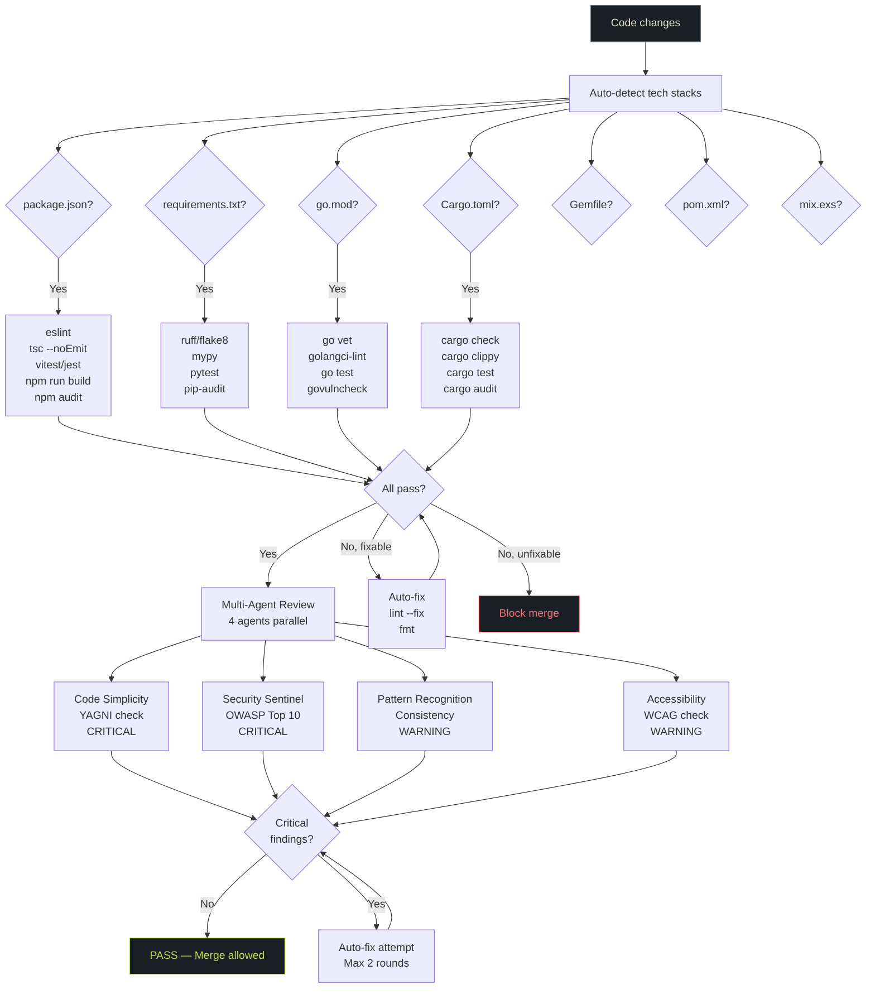

## 9. Patrol System — Exponential Backoff Health Checks

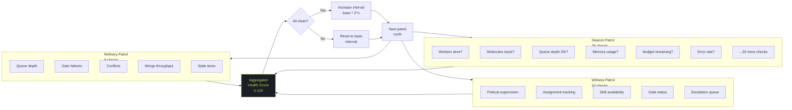

## 10. Guzzoline Gauge — System Fuel

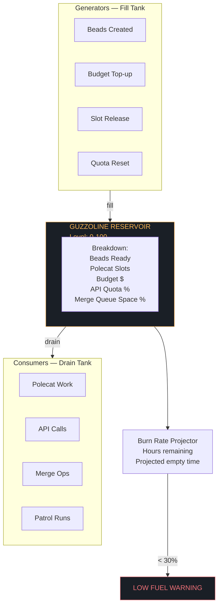

## 11. NDI — Nondeterministic Idempotence (3 Pillars)

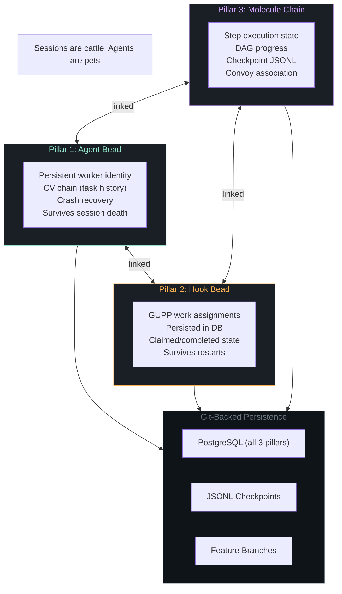

## 12. Intelligence Layer — 34 Cognitive Modules

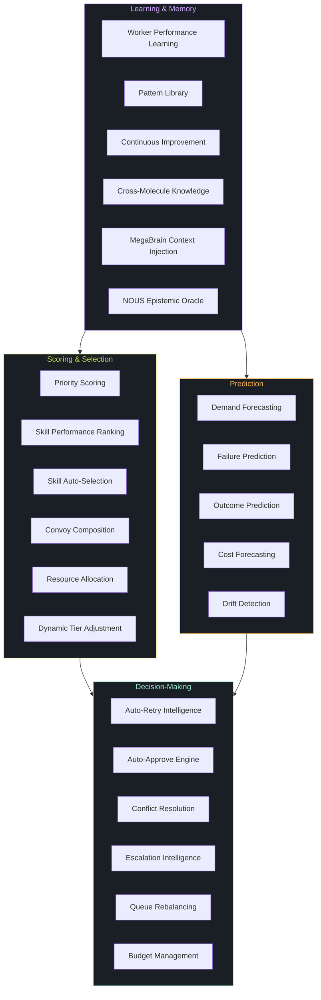

## 13. Mail System — Inter-Agent Communication

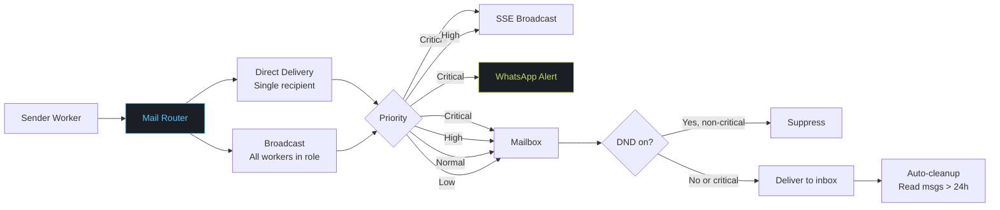

## 14. Deployment Architecture

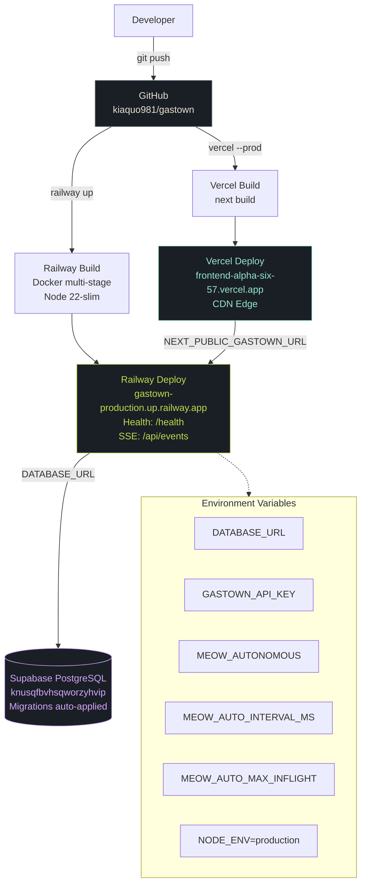

## System Stats

| Metric | Value |
|--------|-------|
| Backend LOC | ~98,000 |
| Frontend LOC | ~22,000 |
| Total LOC | ~120,000 |
| Frontend Views | 26 |
| API Endpoints | ~280 |
| Worker Roles | 9 |
| Cognitive Modules | 34 |
| Sovereign Systems | 28 |
| Built-in Skills | 9 |
| Formula Templates | 10 |
| FrankFlow Modules | 9 |
| Maestro Modules | 5 |
| Patrol Checks | 45 (26+10+9) |
| Tech Stack Gates | 7 |

---

*Gas Town — AI Agent Orchestration Engine*
*"Physics over politeness. If there is work on your hook, YOU MUST RUN IT."*
