# Gas Town — Masterclass Completa

> "Gas Town é Kubernetes cruzado com Temporal — mas pra agentes de IA, não pra containers."
> — Steve Yegge, criador do Gas Town

---

## 1. O QUE É GAS TOWN

Gas Town é uma **fábrica autônoma de código**. Tu joga trabalho, ele organiza, distribui pra agentes de IA, monitora execução, mergeia resultados, e te entrega PRs prontos.

Criado por Steve Yegge (ex-Amazon, ex-Google, autor dos rants lendários) em Go (~189k linhas, ~2000 commits em 17 dias). Lançado em 1 de janeiro de 2026. A versão neste repo é um port TypeScript white-label.

A metáfora é **Mad Max: Fury Road**:
- **Gas Town** = a cidade industrial que produz combustível pro deserto
- **Guzzoline** = o combustível (capacidade computacional)
- **Rigs** = os projetos (como war rigs)
- **Polecats** = os war boys descartáveis que saem, lutam e morrem
- **Refinery** = onde o output bruto é processado e mergeado
- **Convoys** = movimentos coordenados entregando trabalho
- **Wasteland** = o ecossistema de Gas Towns federados

---

## 2. A ESCALA DE MATURIDADE (Stages 1-8)

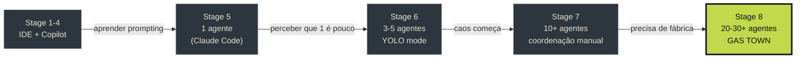

Gas Town é pra quem já tá no Stage 7+ — se tu não tá gerenciando múltiplos agentes simultaneamente, ele vai ser contraproducente.

---

## 3. FILOSOFIA CORE

### "Gado, Não Pets"
- **Sessões são gado** — efêmeras, descartáveis, matáveis
- **Agentes são identidades persistentes** — história e contexto sobrevivem morte de sessão
- **Estado vive no Git e no banco, não na memória** — se crashar, o próximo agente olha o hook e continua

### "Física, Não Educação"
A regra fundamental: **"Se tem trabalho no teu Hook, TU TEM QUE EXECUTAR."**
Sem perguntar, sem esperar, sem discutir. Acordou → olha o hook → executa.

### "Caminho Não-Determinístico, Resultado Convergente"
Cada agente pode tomar caminhos diferentes. Mas o resultado converge porque:
1. O workflow (formula) é imutável
2. Os critérios de aceite são explícitos
3. Os três pilares de persistência rastreiam O QUE foi feito, não COMO

---

## 4. MEOW — O MOTOR MOLECULAR (Molecular Expression of Work)

Todo trabalho no Gas Town passa por 4 fases, modeladas como estados da matéria:

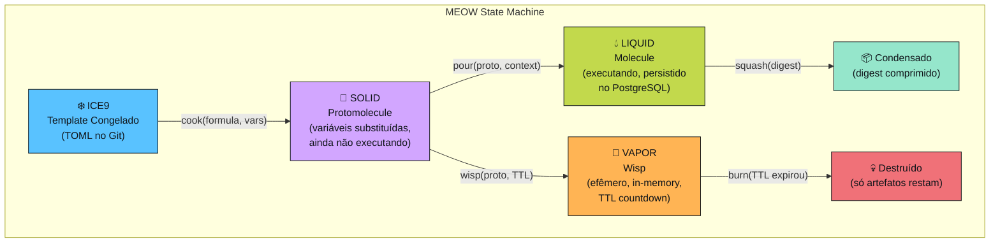

### Operadores Bond (Álgebra MEOW)

| Operador | De | Pra | O que faz |
|----------|-----|-----|-----------|
| `cook` | ICE9 (TOML) | SOLID | Parseia formula, substitui variáveis, valida DAG |
| `pour` | SOLID | LIQUID | Inicia execução, marca steps prontos, persiste no DB |
| `wisp` | SOLID | VAPOR | Cria instância efêmera com TTL (patrulhas, checks) |
| `squash` | LIQUID | LIQUID | Condensa steps completos num digest resumido |
| `burn` | VAPOR | 💀 | Destrói wisp expirado, mantém só artefatos |
| `compound` | ICE9 + ICE9 | ICE9 | Compõe duas formulas numa formula composta |

### Exemplo concreto:

```
1. Formula "bug-fix" existe como TOML no Git (ICE9)

2. Tu pede: "fix o bug #42"
   → cook("bug-fix", {bug_description: "login quebrado"})
   → Protomolecule criada (SOLID)

3. Sistema inicia execução:
   → pour(proto, {repo: "/app"})
   → Molecule ativa (LIQUID), 6 steps no DAG

4. Step 1 "reproduce" fica ready
   → Polecat executa → marca completed
   → Step 2 "diagnose" fica ready automaticamente
   → ... continua até step 6

5. Todos steps completed → Molecule status = completed
```

---

## 5. GLOSSÁRIO COMPLETO

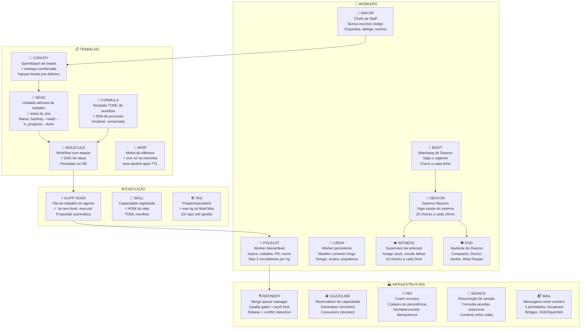

---

## 6. O FLUXO AUTÔNOMO COMPLETO (The Main Loop)

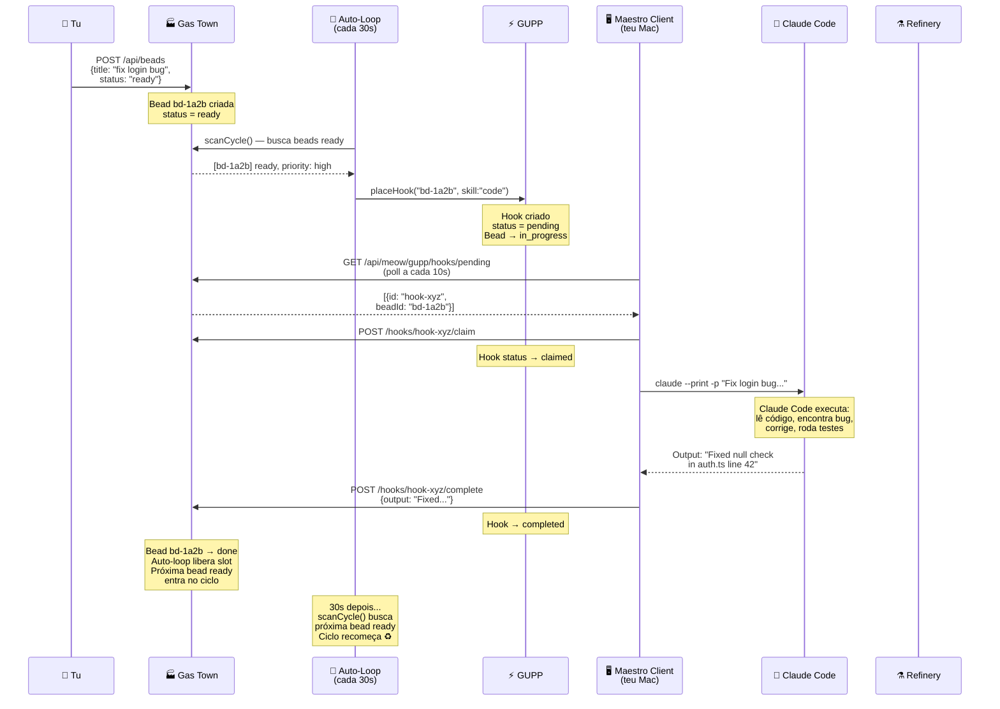

---

## 7. HIERARQUIA DE WORKERS

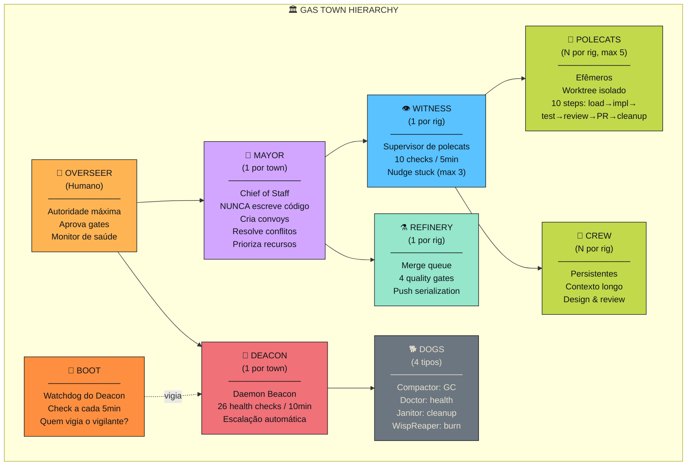

### Modelo de Tiers (custo/poder)

| Tier | Modelo | Workers | Custo/1M tokens |
|------|--------|---------|-----------------|
| **S** (Opus) | O mais capaz | Mayor, Overseer | $15 input / $75 output |
| **A** (Sonnet) | Balanceado | Polecat, Crew, Refinery, Witness | $3 input / $15 output |
| **B** (Haiku) | Rápido e barato | Deacon, Boot, Dogs | $0.25 input / $1.25 output |

---

## 8. LIFECYCLE DO POLECAT (mol-polecat-work)

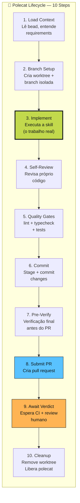

O polecat **nasce, faz tudo isso, entrega o PR, e morre**. Se crashar no step 5, o próximo polecat olha a molecule, vê que steps 1-4 estão completos, e continua do 5.

---

## 9. NDI — CRASH RECOVERY (Nondeterministic Idempotence)

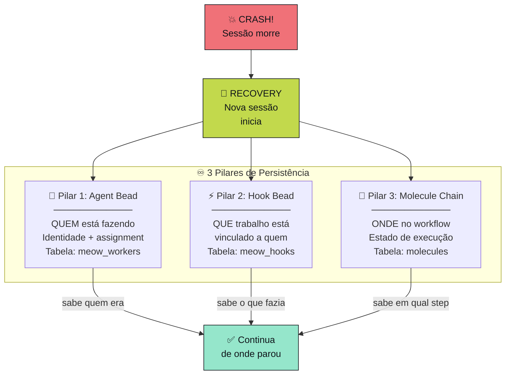

**Se QUALQUER pilar sobrevive, o trabalho pode ser recuperado.**

| Estado | Pilares | Ação |
|--------|---------|------|
| HEALTHY | 3/3 intactos | Continua normalmente |
| DEGRADED | 1 pilar perdido | Recupera do que resta |
| CRITICAL | 2+ pilares perdidos | Deacon escala pro Mayor |

---

## 10. O GUPP — PROPULSÃO UNIVERSAL

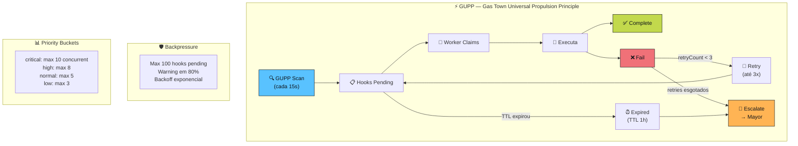

---

## 11. REFINERY — MERGE QUEUE

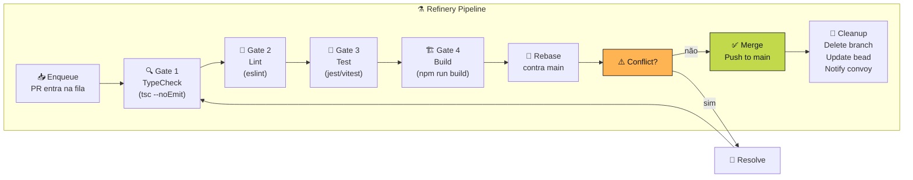

**Push Lock**: só 1 item pode pushar por vez. Isso serializa merges e previne race conditions.

---

## 12. SISTEMA DE PATRULHAS (Health Monitoring)

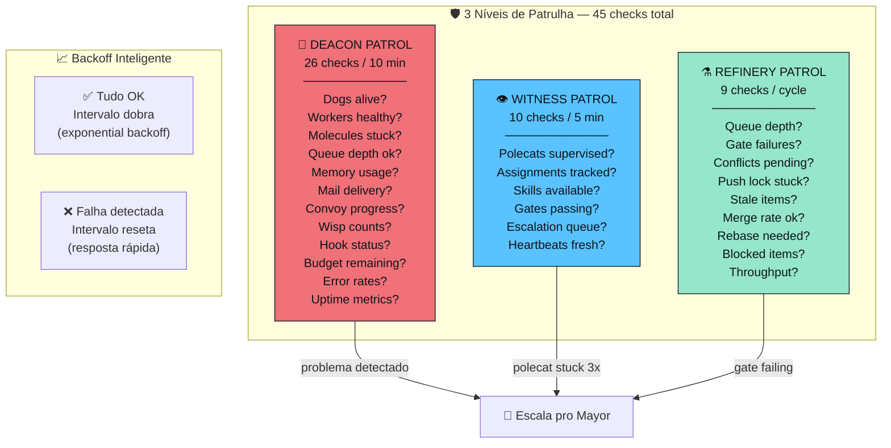

---

## 13. GUZZOLINE — RESERVATÓRIO DE CAPACIDADE

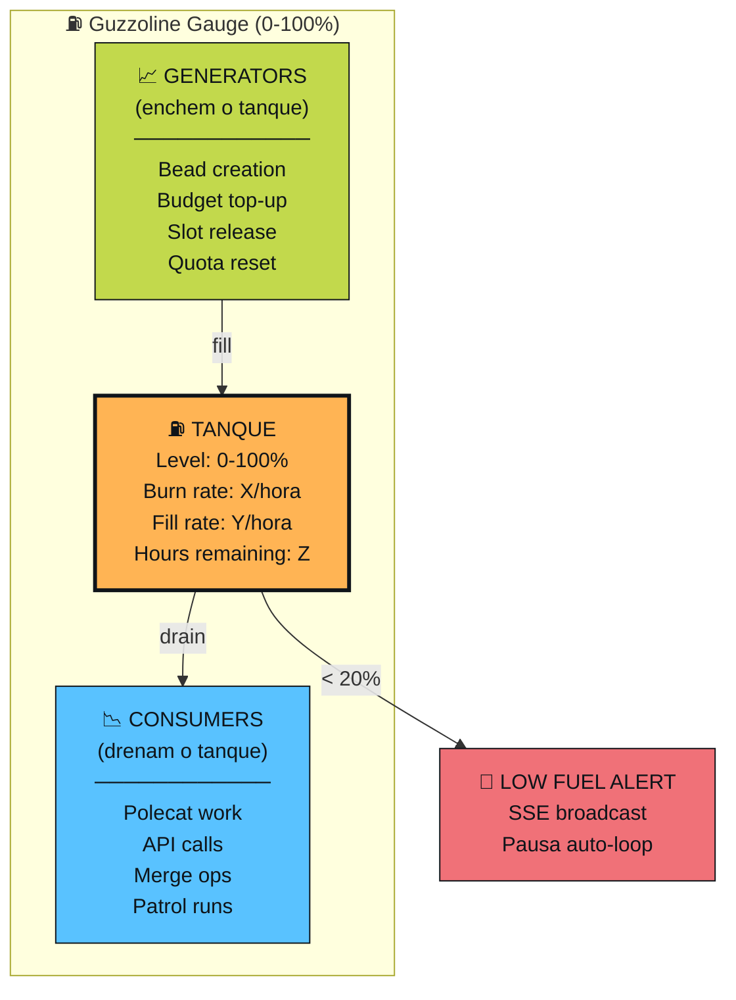

---

## 14. MAIL — COMUNICAÇÃO ENTRE WORKERS

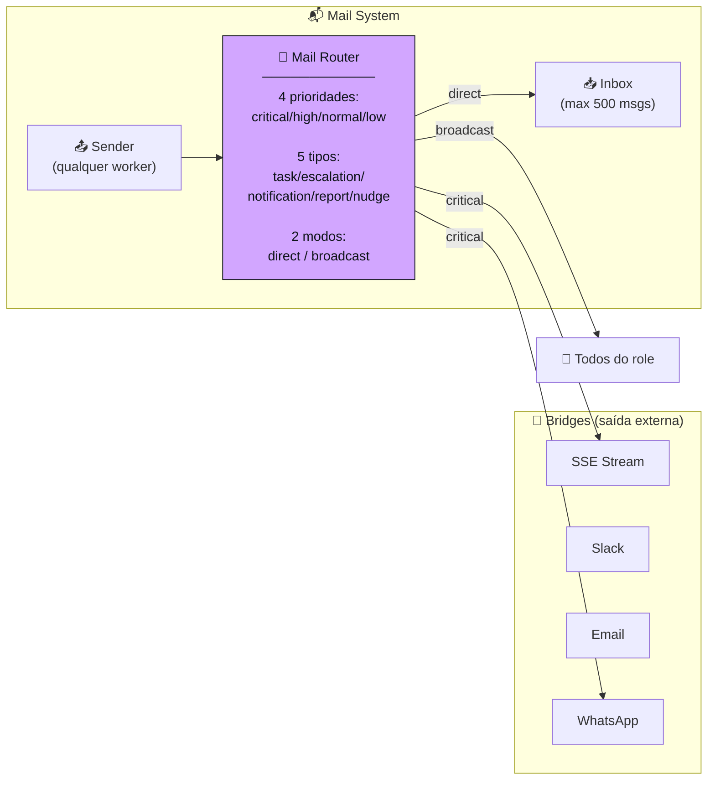

---

## 15. FORMULA — DNA DO WORKFLOW

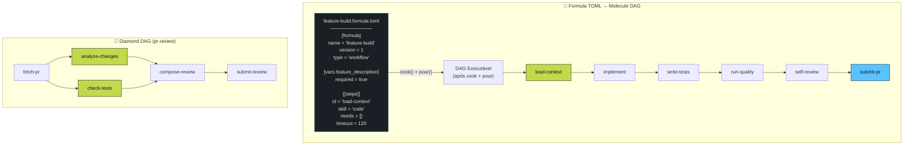

**Diamond DAG**: Steps 2 e 3 rodam em paralelo (ambos dependem só do step 1). Step 4 espera os dois terminarem.

---

## 16. FRANKFLOW — QUALITY GATES

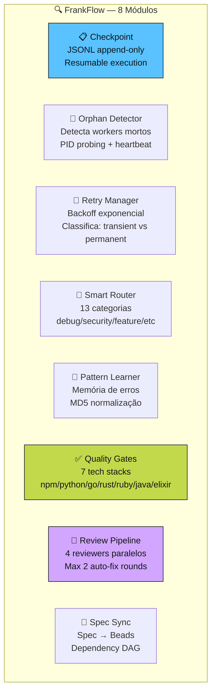

---

## 17. MAESTRO BRIDGE — EXECUÇÃO LOCAL

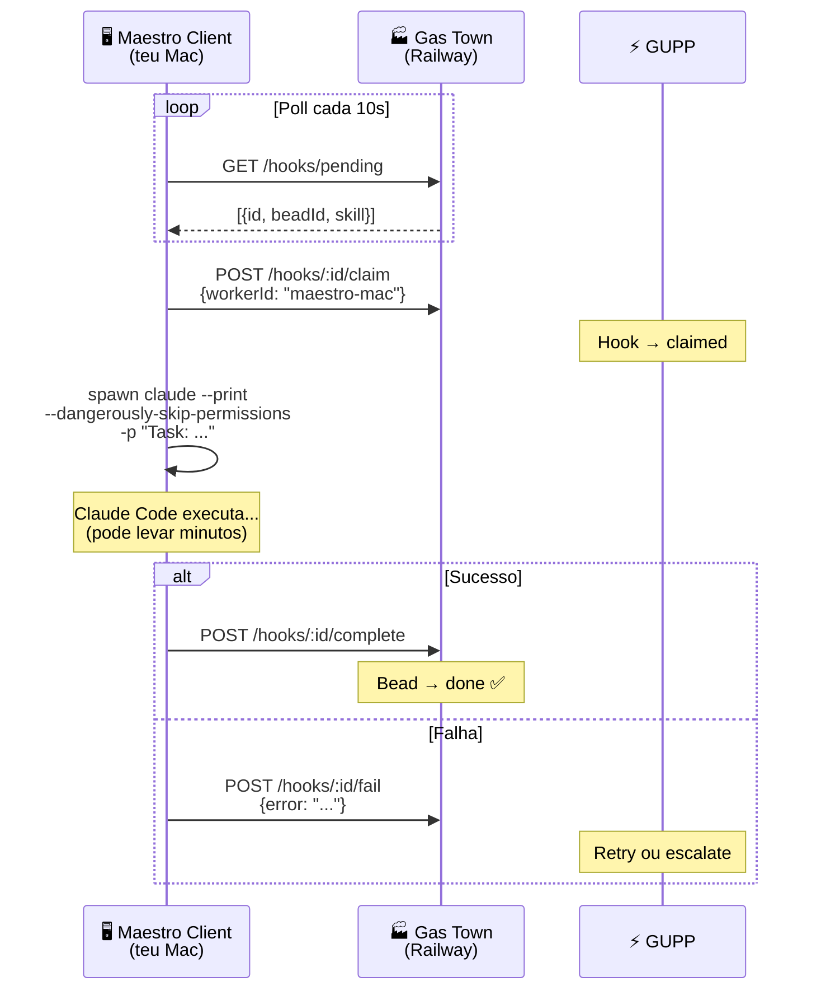

---

## 18. SOVEREIGN SUBSYSTEMS (27 Módulos Avançados)

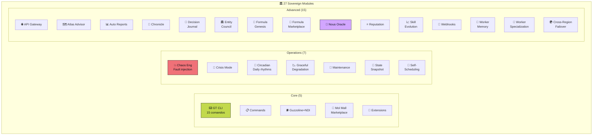

**Chaos Engineering**: "Bota fogo na war rig de propósito — pra quando pegar fogo de verdade, tu já sabe o que fazer."

---

## 19. GAS TOWN vs OUTROS FRAMEWORKS

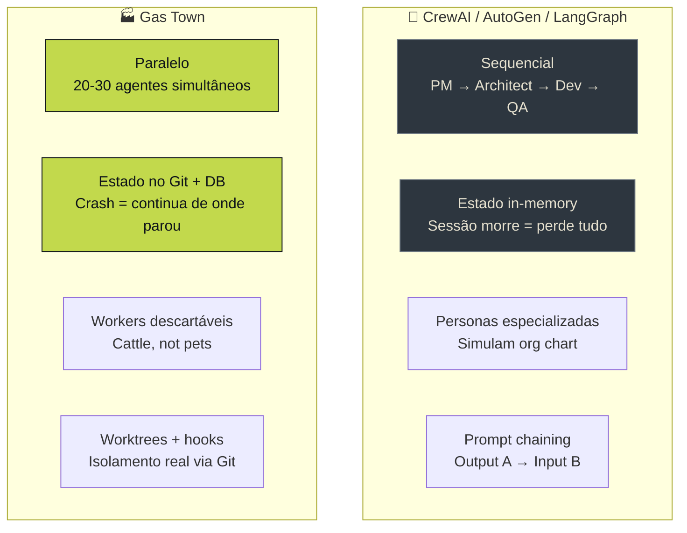

| Aspecto | CrewAI/AutoGen | Gas Town |
|---------|----------------|----------|
| Execução | Sequencial, 1 por vez | Paralelo, 20-30 simultâneos |
| Estado | In-memory | Git + PostgreSQL |
| Crash | Perde tudo | NDI: continua de onde parou |
| Workers | Personas fixas | Descartáveis (polecats) |
| Coordenação | Prompt chaining | GUPP hooks + mail + patrols |
| Merge | Manual | Refinery automática com gates |
| Custo | Baixo ($10-50/mês) | Alto ($2,000-5,000/mês) |

---

## 20. NÚMEROS DO SISTEMA (gastown-wl)

| Métrica | Quantidade |
|---------|------------|
| Backend LOC | ~98,000 |
| Frontend LOC | ~22,000 |
| Worker Roles | 9 |
| Cognitive AI Modules | 32 |
| Sovereign Systems | 27 |
| Formula Templates | 14 |
| FrankFlow Modules | 8 |
| Patrol Checks | 45 (26+10+9) |
| API Endpoints | ~280 |
| Frontend Views | 42 |
| GT CLI Commands | 15 |

---

## 21. RESUMO EM UMA IMAGEM

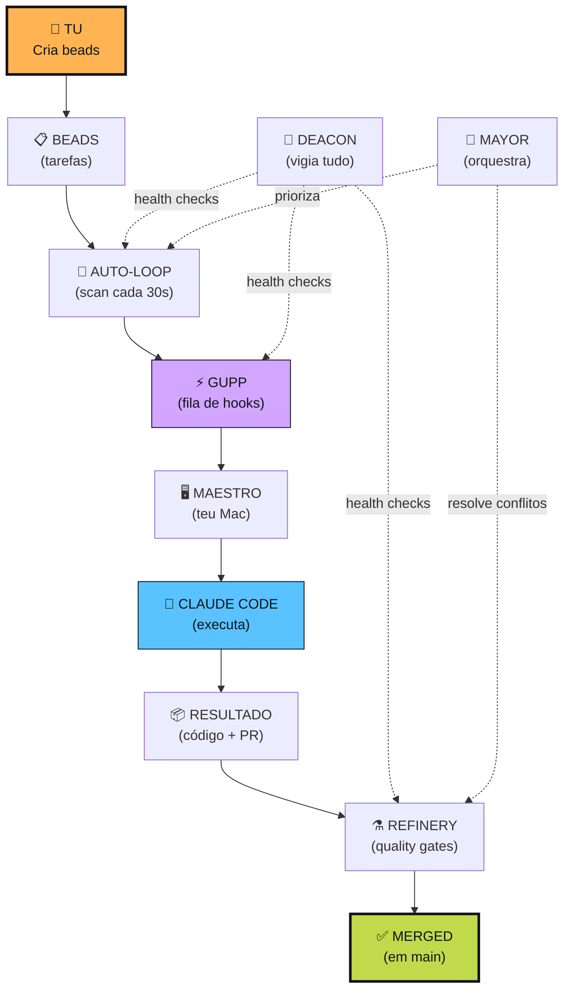

**Tu cria a tarefa. Gas Town faz TODO o resto.**

---

> Fontes: [GitHub steveyegge/gastown](https://github.com/steveyegge/gastown) · [Welcome to Gas Town (Medium)](https://steve-yegge.medium.com/welcome-to-gas-town-4f25ee16dd04) · [Gas Town Emergency User Manual](https://steve-yegge.medium.com/gas-town-emergency-user-manual-cf0e4556d74b) · [The Future of Coding Agents](https://steve-yegge.medium.com/the-future-of-coding-agents-e9451a84207c) · [Welcome to the Wasteland](https://steve-yegge.medium.com/welcome-to-the-wasteland-a-thousand-gas-towns-a5eb9bc8dc1f) · [Maggie Appleton - Gas Town Patterns](https://maggieappleton.com/gastown) · [Steve Klabnik - How to Think About Gas Town](https://steveklabnik.com/writing/how-to-think-about-gas-town/) · [DeepWiki - steveyegge/gastown](https://deepwiki.com/steveyegge/gastown) · Codebase local `~/gastown-wl`
